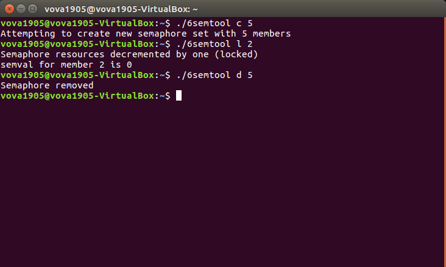

```c
#include <stdio.h>
#include <ctype.h>
#include <stdlib.h>
#include <sys/types.h>
#include <sys/ipc.h>
#include <sys/sem.h>

#define SEM_RESOURCE_MAX  1       /* Initial value of all semaphores */
#define SEMMSL 32

union semun {
  int             val;    /* Value for SETVAL */
  struct semid_ds *buf;    /* Buffer for IPC_STAT, IPC_SET */
  unsigned short  *array;  /* Array for GETALL, SETALL */
  struct seminfo  *__buf;  /* Buffer for IPC_INFO (Linux-specific) */
};

void opensem(int *sid, key_t key);
void createsem(int *sid, key_t key, int members);
void locksem(int sid, int member);
void unlocksem(int sid, int member);
void removesem(int sid);
unsigned short get_member_count(int sid);
int getval(int sid, int member);
void dispval(int sid, int member);
void changemode(int sid, char *mode);
void usage(void);

int main(int argc, char *argv[])
{
  key_t key;
  int   semset_id;

  if (argc == 1) usage();

  /* Create unique key via call to ftok() */
  key = ftok(".", 's');

  switch(tolower(argv[1][0]))
  {
    case 'c':
      if (argc != 3) usage();
      createsem(&semset_id, key,  atoi(argv[2]));
      break;
    case 'l':
      if (argc != 3) usage();
      opensem(&semset_id, key);
      locksem(semset_id, atoi(argv[2]));
      break;
    case 'u':
      if (argc != 3) usage();
      opensem(&semset_id, key);
      unlocksem(semset_id, atoi(argv[2]));
      break;
    case 'd':
      opensem(&semset_id, key);
      removesem(semset_id);
      break;
    case 'm':
      opensem(&semset_id, key);
      changemode(semset_id, argv[2]);
      break;
     default:
      usage();
  }

  return 0;
}

void opensem(int *sid, key_t key)
{
  /* Open the semaphore set - do not create! */

  if ((*sid = semget(key, 0, 0666)) == -1)
  {
    printf("Semaphore set does not exist!\n");
    exit(1);
  }
}

void createsem(int *sid, key_t key, int members)
{
  int cntr;
  union semun semopts;

  if (members > SEMMSL) {
    printf("Sorry, max number of semaphores in a set is %d\n", SEMMSL);
    exit(1);
  }

  printf("Attempting to create new semaphore set with %d members\n", members);

  if ((*sid = semget(key, members, IPC_CREAT|IPC_EXCL|0666)) == -1)
  {
    fprintf(stderr, "Semaphore set already exists!\n");
    exit(1);
  }

  semopts.val = SEM_RESOURCE_MAX;

  /* Initialize all members (could be done with SETALL) */
  for (cntr = 0; cntr < members; cntr++) {
    semctl(*sid, cntr, SETVAL, semopts);
  }
}

void locksem(int sid, int member)
{
  struct sembuf sem_lock= {0, -1, IPC_NOWAIT};

  if (member < 0 || member > (get_member_count(sid) - 1))
  {
    fprintf(stderr, "semaphore member %d out of range\n", member);
    return;
  }

  /* Attempt to lock the semaphore set */
  if (!getval(sid, member))
  {
    fprintf(stderr, "Semaphore resources exhausted (no lock)!\n");
    exit(1);
  }

  sem_lock.sem_num = member;

  if ((semop(sid, &sem_lock, 1)) == -1)
  {
    fprintf(stderr, "Lock failed\n");
    exit(1);
  }
  else
  {
    printf("Semaphore resources decremented by one (locked)\n");
    dispval(sid, member);
  }
}

void unlocksem(int sid, int member)
{
  struct sembuf sem_unlock={ member, 1, IPC_NOWAIT};
  int semval;

  if (member < 0 || member > (get_member_count(sid) - 1))
  {
    fprintf(stderr, "semaphore member %d out of range\n", member);
    return;
  }

  /* Is the semaphore set locked? */
  semval = getval(sid, member);
  if (semval == SEM_RESOURCE_MAX) {
    fprintf(stderr, "Semaphore not locked!\n");
    exit(1);
  }

  sem_unlock.sem_num = member;

  /* Attempt to lock the semaphore set */
  if((semop(sid, &sem_unlock, 1)) == -1)
  {
    fprintf(stderr, "Unlock failed\n");
    exit(1);
  }
  else
  {
    printf("Semaphore resources incremented by one (unlocked)\n");
    dispval(sid, member);
  }
}

void removesem(int sid)
{
  semctl(sid, 0, IPC_RMID, 0);
  printf("Semaphore removed\n");
}

unsigned short get_member_count(int sid)
{
  union semun semopts;
  struct semid_ds mysemds;

  semopts.buf = &mysemds;

  /* Return number of members in the semaphore set */
  return semopts.buf->sem_nsems;
}

int getval(int sid, int member)
{
  int semval;

  semval = semctl(sid, member, GETVAL, 0);

  return semval;
}

void changemode(int sid, char *mode)
{
  int rc;
  union semun semopts;
  struct semid_ds mysemds;

  /* Get current values for internal data structure */
  semopts.buf = &mysemds;

  rc = semctl(sid, 0, IPC_STAT, semopts);

  if (rc == -1)
  {
    perror("semctl");
    exit(1);
  }

  printf("Old permissions were %o\n", semopts.buf->sem_perm.mode);

  /* Change the permissions on the semaphore */
  sscanf(mode, "%ho", &semopts.buf->sem_perm.mode);

  /* Update the internal data structure */
  semctl(sid, 0, IPC_SET, semopts);

  printf("Updated...\n");
}

void dispval(int sid, int member)
{
  int semval;

  semval = semctl(sid, member, GETVAL, 0);

  printf("semval for member %d is %d\n", member, semval);
}

void usage(void)
{
  fprintf(stderr, "semtool - A utility for tinkering with semaphores\n");
  fprintf(stderr, "\nUSAGE:  semtool4 (c)reate <semcount>\n");
  fprintf(stderr, "     (l)ock <sem #>\n");
  fprintf(stderr, "     (u)nlock <sem #>\n");
  fprintf(stderr, "     (d)elete\n");
  fprintf(stderr, "     (m)ode <mode>\n");
  exit(1);
}
```

